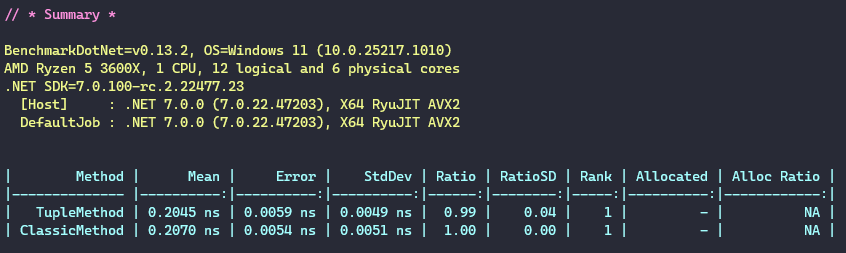
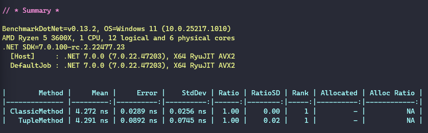

# Clean method to swap variables

## Approach

### Classic way
```csharp
var a = 10;
var b = 20;

var aux = a;
a = b;
b = aux;
```
Check here the [IL](https://sharplab.io/#v2:C4LglgNgNAJiDUAfAAgJgIwFgBQyDMABGgQMIEDeOB1RhyALAQLIAUAlBVTdwG4CGAJwJ8CAXgLoADAG4u3avyEAjMQVQy58zb0HCArgA9VfWdnk0R4pafPUV4voZs0AvjhdA===) result.

### With tuple
```csharp
var a = 10;
var b = 20;

(a, b) = (b, a);
```
Check here the [IL](https://sharplab.io/#v2:C4LglgNgNAJiDUAfAAgJgIwFgBQyDMABGgQMIEDeOB1RhyALAQLIAUAlBVTdwG4CGAJwJ8CAXgLoADAG4u3avyEAjMQVQy58zdxZ8oBJR3Esl+vm1nZuAXxzWgA=) result.


## Benchmark

### For primitive types


### For classes



## Conclusion

In both cases the performance difference is not measurable.

The only difference is that the tuple approach is more readable and less error prone. So, use it! 🤓