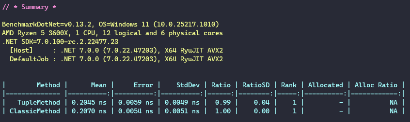
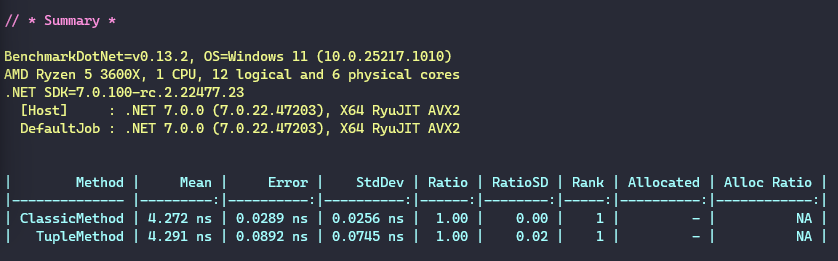

# Swap variables elegantly in C#

[Post](https://medium.com/@NelsonBN/swap-variables-elegantly-in-c-c7aa7c7fb651)

## Approach

### Classic way
```csharp
var a = 10;
var b = 20;

var aux = a;
a = b;
b = aux;
```
[Check here the resulted IL](https://sharplab.io/#v2:C4LglgNgPgAgTARgLACgYGYAE9MGFMDeqmJ2WMALJgLIAUAlIcaSwG4CGATpu5gLyYEABgDczFiQ7cARv0xxR4iUpa12AGkzTGA2tM3t6YlCwC+qU0A=)

### With tuple
```csharp
var a = 10;
var b = 20;

(a, b) = (b, a);
```
[Check here the resulted IL](https://sharplab.io/#v2:C4LglgNgPgAgTARgLACgYGYAE9MGFMDeqmJ2WMALJgLIAUAlIcaSwG4CGATpu5gLyYEABgDczFiQ7cARv0xxR4iUrZceAVwAec9mJQTSvAdL0GSsgey2nSAX1S2gA===)


## Benchmark

### For primitive types


### For classes



## Conclusion

In both cases the performance difference is not measurable.

The only difference is that the tuple approach is more readable and less error prone. So, use it! 🤓


## References
* [Tuple types (C# reference)](https://learn.microsoft.com/en-us/dotnet/csharp/language-reference/builtin-types/value-tuples)
* [Deconstructing tuples and other types](https://learn.microsoft.com/en-us/dotnet/csharp/fundamentals/functional/deconstruct)
